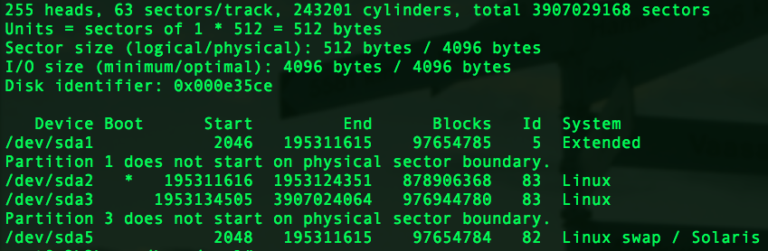
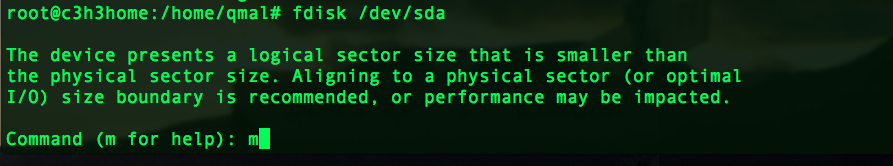
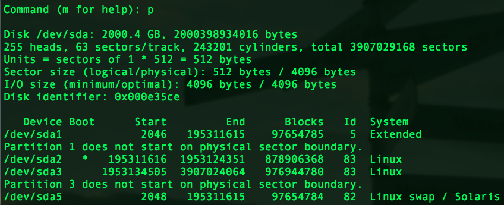
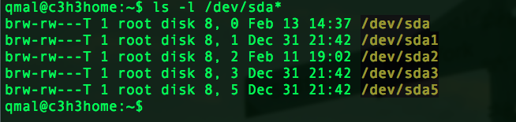

# File System

## Physical Components of Hard Disk

- Sector: 最小的物理儲存單位，每一個 sector 為 512 bytes。
- Cylinder: 磁盤上位於同心圓的 sector 為一個 cylinder，為磁碟分割的最小單位。
- MBR (Master Boot Region): MBR 儲存在第一個 cylinder，包含 boot loader 與其他開機程序，共 446 bytes。
- Partition Table: 位於第一個 cylinder 用來記錄磁碟分割的資料，大小為 64 bytes，可分為主要分割與延伸分割。
- 分割類型:
  - Pirmary: 最多可以有 4 個主要分割。
  - Extension: 最多可以有 1 個延伸分割。
  - Logical: 存在于延伸分割中，可以有多個邏輯分割于一個延伸分割中。

## Ext2/3/4 File System

(圖片截自: <a href="http://linux.vbird.org/linux_basic/0230filesystem.php#harddisk-inode">鳥哥的私房菜</a>)

- 為索引式檔案系統 (indexed allocation)。
- Ext2 是以 block group 來管理整個 file system，每一個 block group 由下列幾個部分組成:
  - Superblock (1024 bytes) 包含:
	- block 與 inode 的總量。
  	- 未使用與已使用的 inode / block 的數量。
  	- block 與 inode 的大小。
  	- 掛載、最後一次寫入、最後一次檢驗磁碟時間。
  	- valid bit。(0 為未掛載、1 為已掛載)
  - Inode table 包含(一個 inode 對應一個檔案):
  	- 每個檔案的 r/w/x mode。
  	- 擁有者與群組資訊。
  	- 容量。
  	- ctime、atime、mtime
  	- flags。(suid, guid...etc)
  	- pointer。
  - Data block: Ext2 支援 1K、2K 與 4K 三種 block size。
  - File System Description: 記錄 block group 開始與結束的 block 號碼還有 superblock、bitmap、inodemap、data block 的 block 起始終結號碼。(可用 dumpe2fs 查看)
  - Block bitmap: 記錄每個 block 對應的號碼與其 block 的使用狀態。
  - Inode bitmap: 記錄每個 inode 的使用狀態。

### Useful Commandline Tools

- `dumpe2fs [-bh] 裝置名`  \# 列出 File System Description
  - -b: 列出保留為壞軌的部分。
  - -h: 僅列 superblock 的資訊。

- `sync`: 把所有暫存在記憶體中的資料寫入硬碟。

- `df [-ahikHTm] [目錄或檔名]`  \# 列出 file system
  - -a: 列出所有 file system。(包含 /proc 等特殊檔案系統)
  - -k: 以 KBytes 顯示。
  - -m: 以 MBytes 顯示。
  - -h: human readable format.
  - -H: M=1000K
  - -T: 連同 partition 的 filesystem 形態列出。(ext2/3/4...)
  - -i: 僅列出 inode 數量。

- `du [-ahsSkm] 檔案或目錄名`  \# disk usage.
  - -a: all
  - -h: human readable
  - -k: KBytes
  - -m: MBytes
  - -s: Sum.
  - -S: Sum by each sub-directories.

- `ln [-sf] source target`  \# link files.
  - -s: symbolic link.
  - -f: if target file exists, create link after removal.

## Partition

### Command line tools

- `fdisk [-l] 裝置名` \# 磁碟分割設定。
  - -l: 列出整個系統所有 partitions
(`fdisk` 需要 root 權限)

ex: ``fdisk -l``

ex: ``fdisk /dev/sda``

(m will list all available commands)

(列出 partition table)

- `partprobe` \# 強制讓 kernel 更新 partition table。
(在不重開機的情況下，每次更新 partition 後都必須執行的指令)

- `mkfs [-t file system 格式] 裝置檔名` \# 格式化工具

- `mke2fs [-b "block 大小"] [-i "block 大小"] [-L "label 名"] [-c[ -c]] [-j]` \# 格式化工具 with 細部參數，亦可用於測試磁碟。
  - -b: 一個 block 的容量。
  - -i: 多少容量配一個 inode。
  - -c: check 硬碟。-c --> 測讀；-c -c --> 測讀 & 寫。
  - -L: label。
  - -j: 加入 journal。(ext2 --> ext3)
ex: ``mke2fs -b 2048 -i 8192 -j -L qmal_disk /dev/sda1``
note: ``mke2fs`` 的參數皆可用於 mkfs。

- `fsck [-t "file system type"] [-ACay] 裝置名` \# 磁碟檢驗修復工具
  - -A: 根據 /etc/fstab 掃描所有裝置。
  - -a: 自動修復有問題的裝置。
  - -y: 同 -a， 有些 binary 只吃 -y 。
  - -C: 顯示進度長條圖。
  - -f (ext2/3 only): 強制檢查。(無論是否 clean)
  - -D (ext2/3 only): 進行最佳化配置。
(必須先卸載才能執行 fsck)

- `badblocks [-svw] 裝置名稱` \# 偵測壞軌
  - -s: 列出所有須檢查的 block
  - -v: 顯示當下進度
  - -w: 執行寫入測試。(建議於空檔案裝置執行此參數)

## Mount

Mount: Connect inodes with directories

- `mount`: (單純執行可顯示掛載資訊)
  - Basic Usage: `mount 裝置檔名 掛載點`
    - Linux 會依據 super block 的內容自動選定參數來 mount，但如果想要細部操作，參照下表：
  - Use with tags: 
    - `mount -a`
    - `mount [-l]`
    - `mount [-t "file system type"] [-L "label name"] [-o options] [-n] 裝置名 掛載點`
    - `mount --bind source_dir target_dir`
    - `mount -o remount,rw,auto,.. 裝置或目錄名`

#### Parameter Table

| Parameter  |               Description                   |
|:----------:|:--------------------------------------------|
|    -a      | 依照 /etc/fstab 來掛載所有未掛載磁碟            |
|    -l      | 顯示 label 名稱                              |
|    -t      | 指定欲掛載類型(etx2/3/4, iso9660...etc)       |
|    -n      | 避免把掛載資訊寫入 /etc/mtab 中 (單人維護模式用) |
|    -L      | 以 label name 掛載                           |
|   --bind   | 把 source_dir mount 到 target_dir。(似 ln -s)|
|    -o      | 見 options 表                                |

#### Options Table

|    Options   |                 Description                |
|:------------:|:-------------------------------------------|
|    ro,rw     | 掛載唯唯讀(ro)或讀寫(rw)                     |
| async, sync  | 使用同步或非同步寫入。預設 async               | 
|  auto, noauto| 是否寫入 /etc/fstab                         |
|   dev, nodev | 是否允許建立裝置檔案                          |
|  suid, nosuid| 是否允許設定 suid                            |
|  exec, noexec| 是否允許儲存可執行的 binary 檔                 |
|  user, nouser| 是否讓一般 user 也可以 mount 此 partition     | 
|    defaults  | == rw, suid, dev, exec, auto, nouser, async|
|    remount   | 重新掛載

- `umount [-fn] 裝置名或掛載點`  \# 卸載 file system
  - -f: 強制卸載
  - -n: 不更新 /etc/mtab 下卸載

- `mknod 裝置檔名 [bcp] [Major] [Minor]` \# 建立裝置檔
  - b: 設為週邊儲存裝置。如硬碟等。
  - c: 設為週邊輸入裝置。如滑鼠。
  - p: 設為 pipe (FIFO)。

[官方硬體裝置代碼表 (major, minor)](http://www.lanana.org/docs/device-list/devices-2.6+.txt)

## /etc/fstab 及 /etc/mtab

- /etc/fstab: 包含開機時自動掛載的資料。
  - dump: 0 --> 不要備份；1 --> 每天備份。
  - pass: 開機時是否檢驗 file system。 0 --> 不要；1 --> 最優先檢查；2 --> 要檢查。

- /etc/mtab: mount table。
  - 為實際 file system 的掛載記錄。
  - 與 /etc/fstab 不同。 /etc/fstab 為開機時的設定檔。

## Swap

建立 Swap 的基本步驟：

1. 用 fdisk 分割一個 swap partition。
2. 用 mkswap 來格式化。
3. swapon 啟動。

- `mkswap 裝置名` \# 格式化為 swap

- `swapon 裝置名` \# 啟動 swap
 - `swapon -s`: 列出當前所有 swap partition。

- `swapoff 裝置名` \# 關閉 swap

=======

# Reference:

<ul>
  <li>
  	<a href="http://linux.vbird.org/">鳥哥的 Linux 私房菜</a>
  </li>
</ul>
